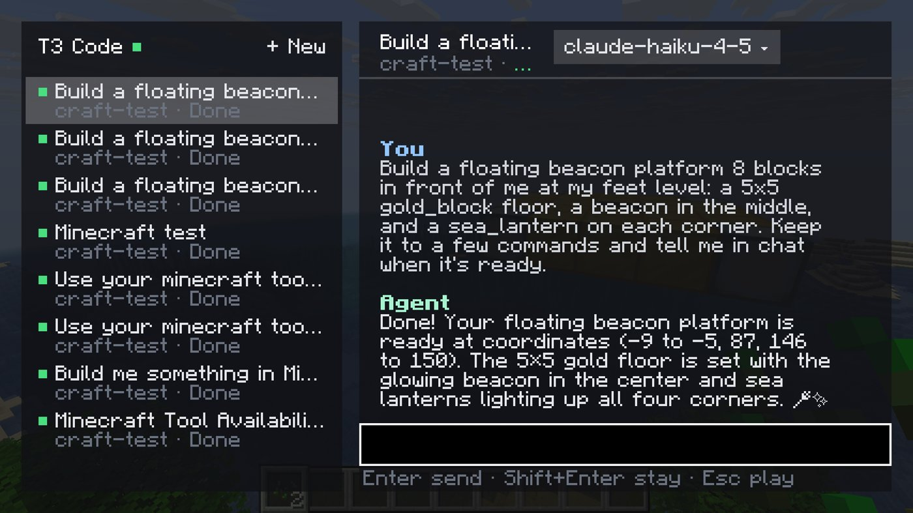
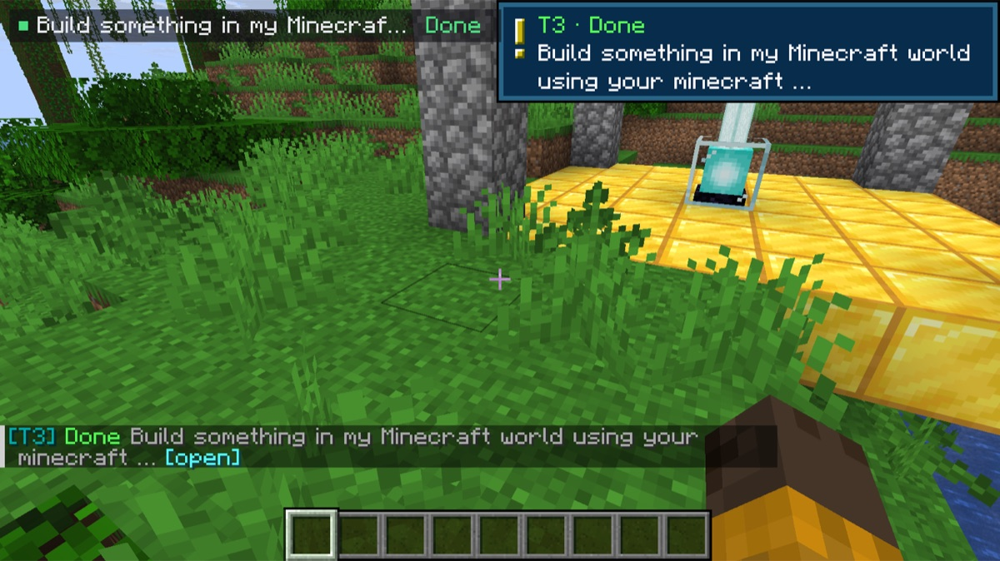
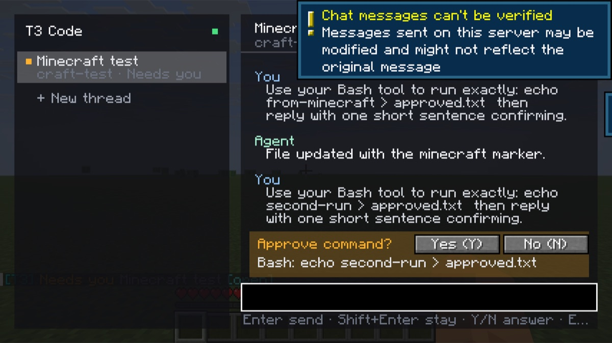
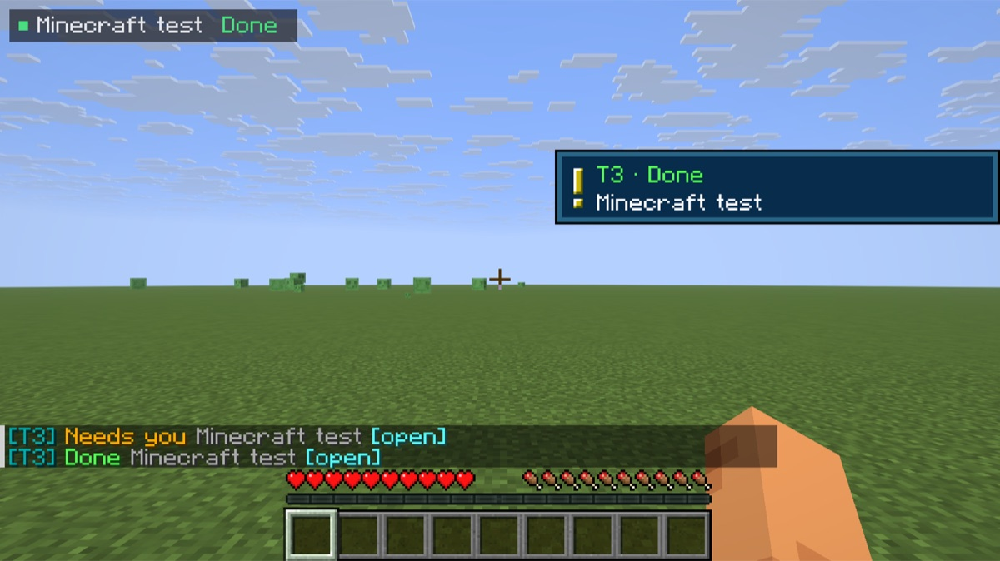

# T3 Craft

[T3 Code](https://t3.codes) inside Minecraft. Send a prompt, go back to mining, and get pinged when the agent finishes, needs an approval, or has a question. Agents can also see and build in your world.





It is a client-side Fabric mod for Minecraft Java 26.3. It connects to your T3 environments the same way the mobile app does, so it works on any server, and prompts never go through server chat.

> **Early prototype.** Tested end to end in the Fabric dev client against T3 Code nightly `0.0.43`. It uses T3's client protocol, which is not a documented public API and may change.

## What it does

- **Panel.** Press **`** to open it. Your threads are on the left and the conversation on the right, with Markdown rendered: headings, lists, code, tables. **Enter** sends the prompt and puts you back in the game; **Shift+Enter** sends and keeps the panel open. **+ New** starts a thread. Unsent text is kept per thread.
- **Several machines.** Pair more than one T3 environment (a laptop and a home server, for example) and every active thread from each shares one scrolling sidebar, tagged with its machine. Click the filter row under the header to show one machine at a time. Actions go to the machine that owns the thread.
- **Pings.** While an agent works or waits on you, the top-left corner shows `Thread · Working 1m 12s · step`. When it finishes, fails, or needs you, you get one toast and a note-block sound. Press **`** within a minute to open the thread that pinged.
- **Approvals and questions.** Approve with **Y** / **N**. When an agent asks something, press **1–9** or click an option, or type your own answer.
- **Model picker.** Click the model name in the panel header. New threads can use any provider; existing threads can switch unless the provider forbids it.
- **Village.** `/t3 village` turns your recent threads into villagers a few blocks ahead. Name tags show status, and particles show what they're doing: enchant glyphs while working, notes when they need you, sparkles when done. Right-click a villager to open its thread. The villagers exist only on your client.
- **Live.** Updates stream over T3's RPC socket. If the socket drops, the mod polls until it reconnects.



Commands: `/t3` (open the panel) · `/t3 pair <link>` · `/t3 unpair` · `/t3 threads` · `/t3 use <n>` · `/t3 ask <prompt>` · `/t3 new <prompt>` · `/t3 approve` · `/t3 deny` · `/t3 stop` · `/t3 village [off]` · `/t3 agent-build on|off`

## Install and pair

1. Install Minecraft Java 26.3 with [Fabric Loader](https://fabricmc.net/use/) 0.19.5+ and [Fabric API](https://modrinth.com/mod/fabric-api). Build the mod (below) and copy `build/libs/t3craft-0.1.3.jar` into `mods/`.
2. In T3 Code, go to **Settings → Connections** and create a pairing link. If Minecraft runs on a different machine from T3, turn on network access first so the link uses an address that machine can reach. For a headless server, run `t3 pair` there.
3. In game, run `/t3 pair <link>`. Repeat for each environment you want to add.

Pairing asks only for `orchestration:read orchestration:operate`. The token lasts 30 days and is saved to `config/t3craft.json` with owner-only permissions. To remove the device, revoke "Minecraft" in T3 under **Settings → Connections**.

## Let agents use Minecraft

The mod runs an MCP server at `http://127.0.0.1:25590/mcp`. It listens on loopback only and refuses requests that come from web pages. It offers four tools:

| Tool | What it does |
| --- | --- |
| `minecraft_status` | Where you are, what you're looking at, time, game mode |
| `minecraft_nearby_blocks` | Block counts around you |
| `minecraft_say` | Posts a message in your chat (only you see it) |
| `minecraft_run_command` | Runs a command as you, e.g. `/fill`, and returns the server's reply. Off until you run `/t3 agent-build on`. Every command appears in your chat. |

```sh
claude mcp add --transport http -s user minecraft http://127.0.0.1:25590/mcp
```

Agents pick this up in new sessions, so start a new thread after adding it. Only agents on the machine running Minecraft can reach it.



## Mac launcher (dev setup)

```sh
./scripts/install-macos-app.sh      # installs "T3 Craft.app" into /Applications
```

Double-clicking **T3 Craft** starts the local test world if it isn't running, opens the Fabric dev client straight into it, and stops the world again when you quit. It needs no Minecraft account (offline dev client). Logs go to `~/Library/Logs/T3Craft/`. The first launch after installing can take about a minute while macOS scans the new app.

## Build and develop

Requires JDK 25 or newer as `JAVA_HOME` (Minecraft 26.x targets Java 25).

```sh
./gradlew build                     # → build/libs/t3craft-0.1.3.jar
./gradlew runServer --args=nogui    # local offline test server in run-server/ (set white-list=false)
./gradlew runClient                 # dev client
```

Checks:

```sh
./gradlew smoke -Pt3url='<pairing link>' [-Pt3prompt='…'] [-Pt3new=true]   # protocol round trip, no Minecraft
./gradlew runClient -Pselftest='<prompt>'        # joins localhost:25565, drives the panel, approves, saves run/screenshots
./gradlew runClient -Pselftest='ask: …'          # answers an agent question with the number keys
./gradlew runClient -Pselftest='pair: <link>' -Pconfig=/tmp/fresh.json   # new-user path: /t3 pair, first panel, drafts
./gradlew runClient -Pselftest='new: …'          # starts a new thread from the panel
./gradlew runClient -Pselftest=look|village|watch|threads [-Pfocus='<thread title>'] [-Pconfig=<path>]
```

`-Pconfig` points the client at a separate pairing file, so tests can use a throwaway T3 server.

## How it works

- **Pairing:** exchanges the T3 pairing link for a bearer token at `/oauth/token`, then uses the same HTTP routes as T3's own clients (`/api/orchestration/shell`, `/threads/:id`, `/dispatch`).
- **Live updates:** a WebSocket (one-time ticket) subscribes to `orchestration.subscribeShell` for thread status. Events from `orchestration.subscribeThread` on the focused thread trigger a refetch of its recent turns, at most four times a second.
- **Notifications:** only the focused thread and threads you prompted from Minecraft notify you. Each new approval or question pings once.
- **Model list:** comes from `server.getConfig` over the same socket.

## License and disclaimer

MIT. See [LICENSE](LICENSE).

NOT AN OFFICIAL MINECRAFT PRODUCT. NOT APPROVED BY OR ASSOCIATED WITH MOJANG OR MICROSOFT.

T3 Craft is an independent community project and is not affiliated with or endorsed by T3 Tools Inc. "T3 Code" is theirs; this mod only talks to it over its client protocol. The jar contains no Minecraft, Fabric, or T3 code.
