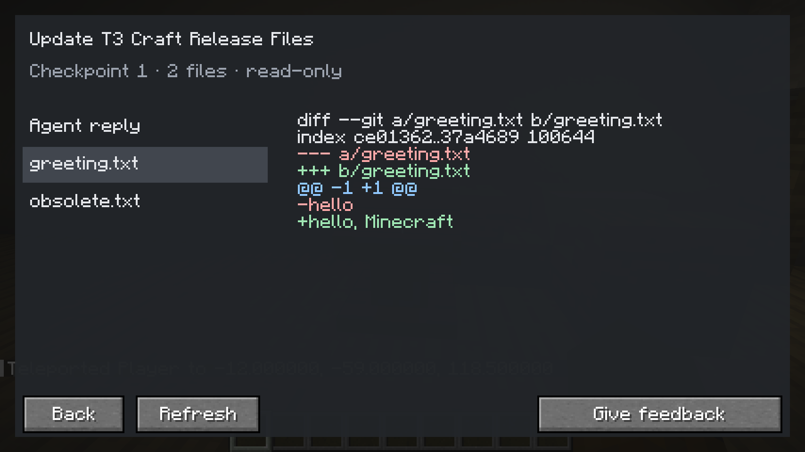
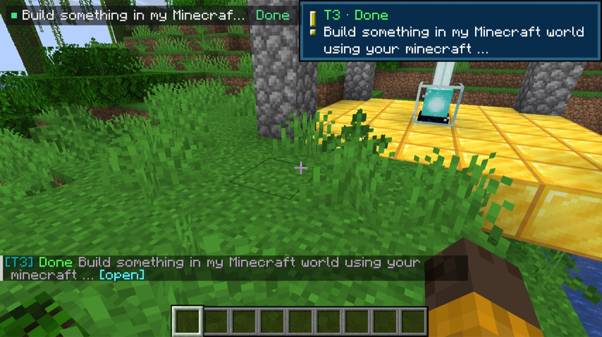
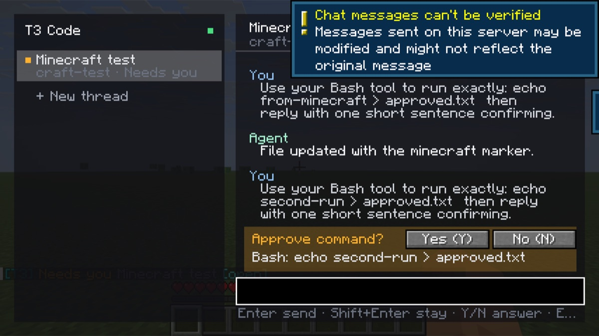
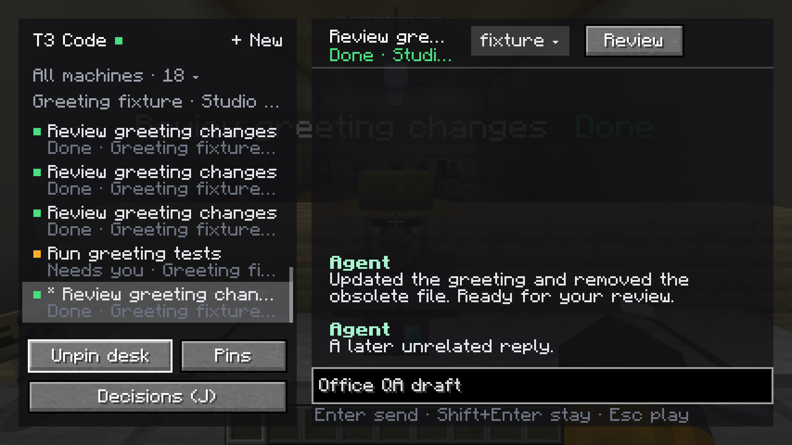
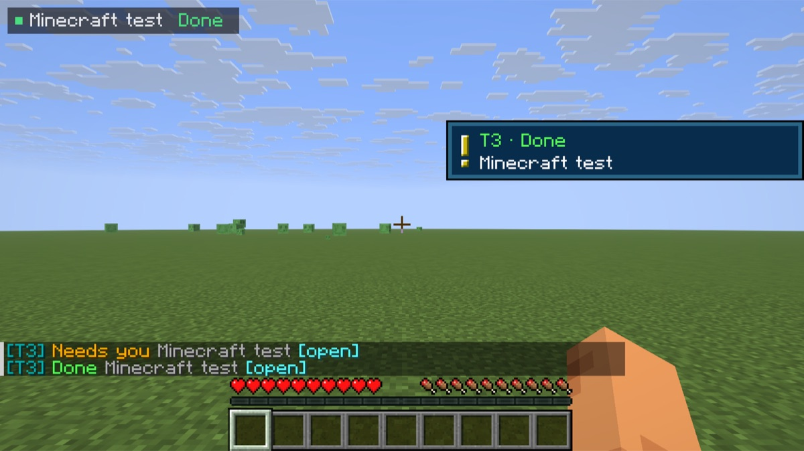

# T3 Craft

[T3 Code](https://t3.codes) inside Minecraft. Keep your existing coding sessions across machines, choose the models T3 offers, answer decisions and review real checkpoint changes while you play. Agents can also see and build in your world when you enable it.



A release jar for ordinary Fabric profiles, with a personal client office or an operator-owned shared server office. [Download 0.3.0](https://github.com/maxwellyoung/t3craft/releases/tag/v0.3.0).



It is a Fabric mod for Minecraft Java 26.3. On the client it connects to your T3 environments the same way the mobile app does, so it works on any server, and prompts never go through server chat. Installed on a dedicated server as well, it can also run a shared village that everyone on the server sees.

> **Early project.** 0.3.0 checkpoint review was verified against T3 Code nightly `0.0.46-nightly.20261004.2644`. The earlier `0.0.46-nightly.20261003.2638` walkthrough also exercised a real agent edit and approvals. It uses T3's client protocol, which is not a documented public API and may change.

## What it does

- **Panel.** Press **`** to open it. Your threads are on the left and the conversation on the right, with Markdown rendered: headings, lists, code, tables. **Enter** sends the prompt and puts you back in the game; **Shift+Enter** sends and keeps the panel open. **+ New** starts a thread. Unsent text is kept per thread.
- **Pinned desks and projects.** Choose **Pin desk** in a thread panel to keep it in this world’s office. **Pins** lists saved pins, including unavailable or archived threads, and lets you remove them. The project filter narrows the sidebar without changing the focused conversation or unsent draft.
- **Several machines.** Pair more than one T3 environment (a laptop and a home server, for example) and every active thread from each shares one scrolling sidebar, tagged with its machine. Click the filter row under the header to show one machine at a time. Actions go to the machine that owns the thread.
- **Pings.** While an agent works or waits on you, the top-left corner shows `Thread · Working 1m 12s · step`. When it finishes, fails, or needs you, you get one toast and a note-block sound. Press **`** within a minute to open the thread that pinged.
- **Approvals and questions.** Approve with **Y** / **N**. When an agent asks something, press **1–9** or click an option, or type your own answer.
- **Model picker.** Click the model name in the panel header. New threads can use any provider; existing threads can switch unless the provider forbids it.
- **Village.** `/t3 village` turns your recent threads into villagers a few blocks ahead. Name tags show status, and particles show what they're doing: enchant glyphs while working, notes when they need you, sparkles when done. A villager that needs you shows what it's asking on its name tag, e.g. `Needs you: Bash: npm test`; right-click it to open its thread and approve. The villagers exist only on your client, and each world keeps its own village.
- **Report books.** When a thread you started or opened in Minecraft finishes, you get a written book with the agent's reply and the files it changed. Needs command permission (op, or cheats on); `/t3 books off` turns it off.
- **Live.** Updates stream over T3's RPC socket. If the socket drops, the mod polls until it reconnects.



Commands: `/t3` (open the panel) · `/t3 pair <link>` · `/t3 unpair` · `/t3 decisions` · `/t3 review` · `/t3 threads` · `/t3 use <n>` · `/t3 ask <prompt>` · `/t3 new <prompt>` · `/t3 approve` · `/t3 deny` · `/t3 stop` · `/t3 pin` (toggle focused thread) · `/t3 pins` · `/t3 village [off]` · `/t3 books on|off` · `/t3 agent-build on|off`

## Office

`/t3 office` builds an agent office with one floor per paired machine. Residents work at their desks, wait at the whiteboard for decisions, and return to the lounge when finished. The whiteboard and review lectern open the decision and checkpoint screens. Each world remembers its office location; rebuilding changes blocks and requires command permission. `/t3 office off` disables the office view. A dedicated server can pair with `/t3village pair <link>` and build its shared office with `/t3office build`.

In 0.3.0, each machine has eight stable desk slots. Pins take priority, then waiting threads, working threads and recent conversations. Included residents keep their slot when activity reorders the sidebar; pinned identity survives reconnect and client restart. Offline residents are labelled Offline and stop emitting work effects or typing sounds. A resident still walks to the whiteboard or lounge when its status changes, returning to its own chair when working again. Pins are saved per world and dimension, keyed by the owning environment and thread. Re-pairing or renaming a machine keeps its floor order. An archived/unavailable pin is shown in **Pins**; it has no resident and can be removed. An unavailable pin’s old slot can be used temporarily and is reclaimed if the pin returns.

Shared offices have separate operator-owned preferences: `/t3office pin <thread-id>` and `/t3office unpin <thread-id>`. Client pins do not change the shared office. A paired client can open a shared resident’s thread without placing its own village. Pins and project filters change only Minecraft presentation, never agent permissions. Plain `/t3 village` remains a recent-thread arrangement.



*The office navigation capture uses isolated two-machine fixtures; the checkpoint capture above reads an actual installed T3 session.*

## Decision desk and checkpoint review (0.2.0)

Press **J**, run `/t3 decisions`, or right-click the office whiteboard to see pending approvals and questions across every paired machine. The queue includes older threads beyond the office's eight residents per floor. It shows the machine, project, request and age; opening a row targets that exact request. Responses are rechecked against current T3 state before dispatch. Offline machines retain their last-known requests with answering disabled.

Use **Review** in the thread header, `/t3 review`, or the office lectern to inspect the latest ready checkpoint. Choose a file for its complete Git patch, including deletions, rename metadata and binary-file notices. Arrow keys scroll or pan; **Home** resets the view and **F5** refreshes. The displayed agent reply is matched to the checkpoint; if it falls outside recent history the screen says so. **Give feedback** opens that thread's composer and preserves any existing unsent draft. This screen does not apply or merge changes, and does not imply tests passed.

Tested against legacy and protocol 2 fixtures, plus the installed T3 Code nightly with live streams, a real agent edit, approvals and checkpoint retrieval. The client sends the required protocol 2 header, adapts run projections and uses RPC dispatch on current nightlies. Older servers retain their HTTP dispatch path.

## Install and pair

0.2.1 hardens local MCP access: native clients must address the exact loopback host and port; browser requests carrying an `Origin` header are refused. Requests larger than 64 KiB are refused. The command tool still requires `/t3 agent-build on` and the player's server permissions. Local programs with access to this endpoint share that permission.

Connection errors now remain visible above a cached conversation. Expired/revoked pairings explain how to create a new link; unsupported T3 protocols explain which component needs an update. Offline threads are labelled in the sidebar, and drafts survive reconnects.

**Quickest:** paste this into your coding agent (Claude Code, Codex, T3 Code itself…) on the machine you play Minecraft on:

```text
Set up T3 Craft (https://github.com/maxwellyoung/t3craft) on this machine so I can use T3 Code from inside Minecraft Java 26.3.

1. Find my Minecraft folder: ~/Library/Application Support/minecraft on macOS, %APPDATA%\.minecraft on Windows, ~/.minecraft on Linux. If it doesn't exist, stop and tell me to install Minecraft Java and launch it once.
2. If there's no versions/fabric-loader-*-26.3 folder in it, install Fabric Loader: get the latest installer jar from https://meta.fabricmc.net/v2/versions/installer and run
   java -jar fabric-installer.jar client -dir "<Minecraft folder>" -mcversion 26.3
   If no Java is available to run it, tell me to run the installer from https://fabricmc.net/use/installer/ myself.
3. In <Minecraft folder>/mods (create it if needed), add:
   - the latest Fabric API for 26.3 from https://api.modrinth.com/v2/project/fabric-api/version?game_versions=["26.3"]&loaders=["fabric"]
   - the latest t3craft jar from https://api.github.com/repos/maxwellyoung/t3craft/releases/latest, after checking its SHA-256 against the release notes.
   Remove older t3craft-*.jar and fabric-api-*.jar files there. Leave my other mods alone, and delete anything else you downloaded.
4. If you support MCP servers, add one named "minecraft" at http://127.0.0.1:25590/mcp (streamable HTTP; it only answers while Minecraft is running). For Claude Code:
   claude mcp add --transport http -s user minecraft http://127.0.0.1:25590/mcp
5. Then tell me the steps only I can do: in the Minecraft Launcher, play the fabric-loader-…-26.3 profile; in T3 Code, create a pairing link under Settings → Connections; in game, run /t3 pair <link> and press ` to open the panel. Never ask me to paste the pairing link or any token to you.
```

Or by hand:

1. Install Minecraft Java 26.3 with [Fabric Loader](https://fabricmc.net/use/) 0.19.5+ and [Fabric API](https://modrinth.com/mod/fabric-api). Download `t3craft-0.3.0.jar` from [Releases](https://github.com/maxwellyoung/t3craft/releases/latest) (or build it, below) and put it in `mods/`.
2. In T3 Code, go to **Settings → Connections** and create a pairing link. If Minecraft runs on a different machine from T3, turn on network access first so the link uses an address that machine can reach. For a headless server, run `t3 pair` there.
3. In game, run `/t3 pair <link>`. Repeat for each environment you want to add.

Pairing asks only for `orchestration:read orchestration:operate`. The token lasts 30 days and is saved to `config/t3craft.json` with owner-only permissions. To remove the device, revoke "Minecraft" in T3 under **Settings → Connections**.

## Shared village (server)

Put the same jar (and Fabric API) in a dedicated server's `mods/` folder, then as an operator:

```text
/t3village pair <link>   # pair the server with a T3 environment (token saved to the server's config/t3craft.json)
/t3village here          # place the village a few blocks in front of you
/t3village status        # connection, thread count, where it is
/t3village off           # remove it
```

The server's recent threads become real villagers that every player sees, with or without the mod, including what a waiting thread is asking. Players who have the mod and are paired with the same T3 can right-click one to open its thread. Anyone on the server can read the thread titles and pending commands on the name tags, so only pair a server you share with people you'd show them to.

## Let agents use Minecraft

The mod runs an MCP server at `http://127.0.0.1:25590/mcp`. It listens on loopback only and refuses requests that come from web pages. It offers four tools:

| Tool | What it does |
| --- | --- |
| `minecraft_status` | Where you are, what you're looking at, time, game mode |
| `minecraft_nearby_blocks` | Block counts around you |
| `minecraft_say` | Posts a message in your chat (only you see it) |
| `minecraft_run_command` | Runs a command as you, e.g. `/fill`, and returns the server's reply. Off until you run `/t3 agent-build on`. Every command appears in your chat. |

```sh
claude mcp add --transport http -s user minecraft http://127.0.0.1:25590/mcp
```

Agents pick this up in new sessions, so start a new thread after adding it. Only agents on the machine running Minecraft can reach it.



## Mac launcher (dev setup)

```sh
./scripts/install-macos-app.sh      # installs "T3 Craft.app" into /Applications
```

Double-clicking **T3 Craft** starts the local test world if it isn't running, opens the Fabric dev client straight into it, and sends `stop` to save and shut down only the world it started when you quit. Existing worlds and other launcher profiles keep running. It needs no Minecraft account (offline dev client). An existing `JAVA_HOME` is respected; otherwise the launcher locates Java 25+. Logs go to `~/Library/Logs/T3Craft/`. If a remote T3 server only answers on its own loopback, list SSH tunnels in `scripts/tunnels.local` (`local-port ssh-host remote-host:port`, one per line, not committed); the launcher opens them first, and you point that environment at `http://127.0.0.1:<local-port>`. The first launch after installing can take about a minute while macOS scans the new app.

The dev client plays as `Player` unless you set a name in `scripts/launcher.local` (not committed), which also lets the app open a different local world:

```sh
# scripts/launcher.local
T3CRAFT_USERNAME=Steve              # offline name; keeps your op status and inventory on the local world
T3CRAFT_SERVER_DIR=run-server       # which local world (its server.properties sets the port)
# T3CRAFT_LOG_DIR=<folder>          # optional separate logs for this profile
```

For a second world with its own app, give it its own profile and server folder (with a different `server-port`), then run `./scripts/install-macos-app.sh --name "My World" --profile scripts/my-world.local`.

## Build and develop

Requires JDK 25 or newer as `JAVA_HOME` (Minecraft 26.x targets Java 25).

```sh
./gradlew build                     # → build/libs/t3craft-0.3.0.jar
./gradlew runServer --args=nogui    # local offline test server in run-server/ (set white-list=false)
./gradlew runClient                 # dev client
```

Checks:

```sh
./gradlew smoke -Pt3url='<pairing link>' [-Pt3prompt='…'] [-Pt3new=true]   # protocol round trip, no Minecraft
./gradlew runClient -Pselftest='<prompt>'        # joins localhost:25565, drives the panel, approves, saves run/screenshots
./gradlew runClient -Pselftest='ask: …'          # answers an agent question with the number keys
./gradlew runClient -Pselftest='pair: <link>' -Pconfig=/tmp/fresh.json   # new-user path: /t3 pair, first panel, drafts
./gradlew runClient -Pselftest='new: …'          # starts a new thread from the panel
./gradlew runClient -Pselftest='villageflow: …'  # name-tag detail, approve by right-clicking the villager, report book
./gradlew runClient -Pselftest='shared: <link>'  # /t3village pair + here on the local server, right-click a real villager, off
./gradlew runClient -Pselftest=look|village|watch|threads [-Pfocus='<thread title>'] [-Pconfig=<path>]
```

`-Pconfig` points the client at a separate pairing file, so tests can use a throwaway T3 server.

## How it works

- **Pairing:** exchanges the T3 pairing link for a bearer token at `/oauth/token`, then negotiates the environment's declared protocol. Legacy servers use HTTP thread snapshots and dispatch; protocol 2 uses bounded thread projections and RPC dispatch. Unsupported protocols fail with update guidance.
- **Live updates:** a WebSocket (one-time ticket) subscribes to `orchestration.subscribeShell` for thread status. Events from `orchestration.subscribeThread` on the focused thread trigger a refetch of its recent turns, at most four times a second.
- **Notifications:** only the focused thread and threads you prompted from Minecraft notify you. Each new approval or question pings once.
- **Model list:** comes from `server.getConfig` over the same socket.

## Focused development checks

Start the isolated fixtures in one terminal:

```sh
python3 scripts/feature-fixture.py --config "$PWD/run/feature-fixture.json"
```

Then run `./gradlew featureCheck`. It exercises two-machine routing, older waiting threads, stale requests, disconnect/reconnect, checkpoint reply identity, and deleted/binary/renamed/empty patches. It never uses a real pairing or dispatches to an agent. Run the fixture with `--protocol2 --port 25682`, then `./gradlew featureCheck -PfixturePort=25682`, to exercise current T3 wire shapes. CI checks both protocols.

`./gradlew officeCheck` verifies stable assignments, pin/waiting/working priority, actual configuration save/load, owner/project identity, removal and independent client/shared preferences with synthetic data. It does not contact an agent.

`./gradlew reliabilityCheck` (or `-PfixturePort=25682`) checks MCP Host/Origin policy and auth/protocol recovery with the same isolated fixtures. `python3 scripts/check-launcher.py` checks that client success and failure both save/stop only the launcher-owned console server, preserving unrelated and reused servers. It never launches Minecraft or reads a user world.

While the isolated Minecraft client is running, `python3 scripts/check-mcp.py` verifies the actual HTTP endpoint with read-only `tools/list` requests, rejected browser origins/Host headers and malformed/oversized bodies. It never runs a game tool.

With protocol 2 fixtures reset and a disposable server running, `./gradlew runClient -Pselftest=connection-errors -Pjoin=localhost:25690 -Pconfig=<fixture-config>` verifies visible per-machine recovery guidance, reconnection and preserved drafts in the actual game. It requires the isolated fixtures on 25682/25683.

The `stable-office` self-test uses protocol 2 fixtures on 25682/25683 and a disposable world to pin through the actual button, build the office, add six newer threads, and check the same desk/entity plus project filtering and draft preservation. It logs the saved desk index. Restart with `stable-office-restore` and `-PexpectedDesk=<index>` to check persistence, archived resident removal and safe unpinning. The `stable-shared` test requires that disposable server also paired to the fixture; it exercises operator pin/unpin, spatial continuity and physically opening a shared resident without a local village. Reset fixtures between independent scenarios.

For the game walkthrough, use a disposable creative dev server with `Player` opped. Reset both fixtures after the Java checks, then join that server:

```sh
curl -fsS http://127.0.0.1:25680/_qa/reset
curl -fsS http://127.0.0.1:25681/_qa/reset
./gradlew runClient -Pselftest=desk-review -Pjoin=localhost:25690 -Pconfig="$PWD/run/feature-fixture.json"
```

The walkthrough builds an office in that test world, enters through the whiteboard, approves only the fixture request, opens the lectern, clicks both patch files and checks the unsent feedback draft. It saves framebuffer screenshots in `run/screenshots/` and logs `SELFTEST RESULT PASS` before quitting. Use a disposable world: the build changes blocks.

`./gradlew reviewProbe -Pconfig=<existing-local-config>` is a read-only compatibility probe against a saved pairing. It prints checkpoint/file counts without credentials or file content and sends no agent commands.

`./gradlew liveCheck -Pconfig=<existing-local-config> -PqaProject=<descriptor>` is opt-in and calls a real agent. Supply a disposable Git project containing `greeting.txt` (`hello` plus a newline) and `obsolete.txt`; the descriptor has `projectId` and `workspaceRoot`. It creates a new QA thread, approves only that thread's requests, and verifies the edit, deletion, live streams and checkpoint. It does not commit or push the QA repository.

## What comes next

- Guided machine connections and re-pairing, with clear health and expiry recovery.
- More readable activity and checkpoint navigation, using actual backend events and test receipts.
- A short actual-game demonstration and broader distribution after ordinary-launcher installation checks.

These are proposals, not shipped features or release dates.

## License and disclaimer

MIT. See [LICENSE](LICENSE).

NOT AN OFFICIAL MINECRAFT PRODUCT. NOT APPROVED BY OR ASSOCIATED WITH MOJANG OR MICROSOFT.

T3 Craft is an independent community project and is not affiliated with or endorsed by T3 Tools Inc. "T3 Code" is theirs; this mod only talks to it over its client protocol. The jar contains no Minecraft, Fabric, or T3 code.
